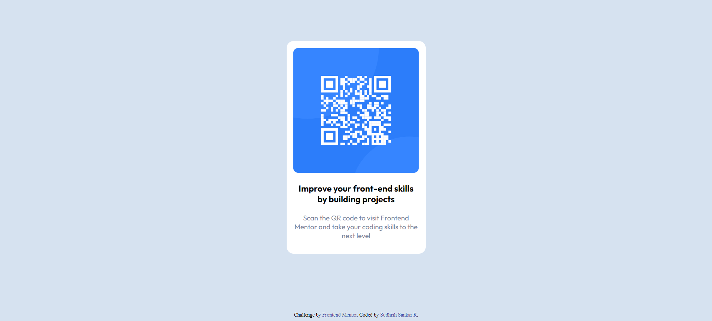

# Frontend Mentor - QR code component solution

This is a solution to the [QR code component challenge on Frontend Mentor] 

## Overview

### Screenshot



### Links

- Solution URL: [Add solution URL here](https://your-solution-url.com)
- Live Site URL: [Add live site URL here](https://your-live-site-url.com)

## My process

### Built with

- Semantic HTML structure
- Basic CSS layout
- CSS styling
- Flexbox for layout
- Media queries for responsiveness

### What I learned

Use this section to recap over some of your major learnings while working through this project. Writing these out and providing code samples of areas you want to highlight is a great way to reinforce your own knowledge.

To see how you can add code snippets, see below:

```css
.proud-of-this-css {
  display: flex;
  justify-content: center;
  flex-direction: column;
}
```

### Continued development

Explore using CSS grid for potentially more complex layouts in future projects.

### Useful resources

- (https://www.youtube.com/watch?v=DJq6R2b0FoE&list=PLpcSpRrAaOargYaCNYxZCiFIp9YTqEl-l&index=3) This helped me for understanding the concept of flexbox.

## Author

- Website - [Sudhish Sankar R](https://sudhish07.github.io/Portfolio/)
- Frontend Mentor - [@Sudhish07](https://www.frontendmentor.io/profile/Sudhish07)
- Twitter - [@sudhee004](https://x.com/sudhee004?t=pqZZzAV0eCly-cAQ1Zm1_g&s=09)

## Acknowledgments

A big thanks to the YouTube channel Learnwebcode (https://www.youtube.com/@LearnWebCode) for their tutorials.
Their content was instrumental in helping me understand and complete this project.
